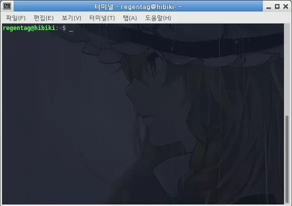

# gif-live
 * [한국어 README](README.ko-KR.md)

Play the GIF file in the terminal as a curl animation.
Inspired by [hugomd/ascii-live](https://github.com/hugomd/ascii-live), but Echo is used instead of Gorilla Mux.



# Running locally
To run the server locally on port `:1323`, run:
```bash
go run main.go
```

After the server runs, run the following command in another terminal:
```bash
curl http://localhost:1323/[gifname]
```

As an example, we include the following three GIF files:
 * chirno
 * reimu
 * cat

# Online Demo
If you don't have a Golang development environment or want to see only the results of the implementation, please check at the following address. Lag may occur or slow because it is running in Heroku.
```bash
curl https://hamkong.herokuapp.com/gifanime?g=[gifname]
```

`chirno`, `reimu` and `cat` are provided equally for gifname.

# aisimage
gif-live uses a modified `ansimage` module code on [eliukblau/pixel](https://github.com/eliukblau/pixterm) to draw GIF files on the terminal.
Eliuk Blau has the right to the original source code of `ansimage`.

# Additional info.
This README document has been translated from Korean to English using papago. If you find anything wrong, please write a new Issue.
